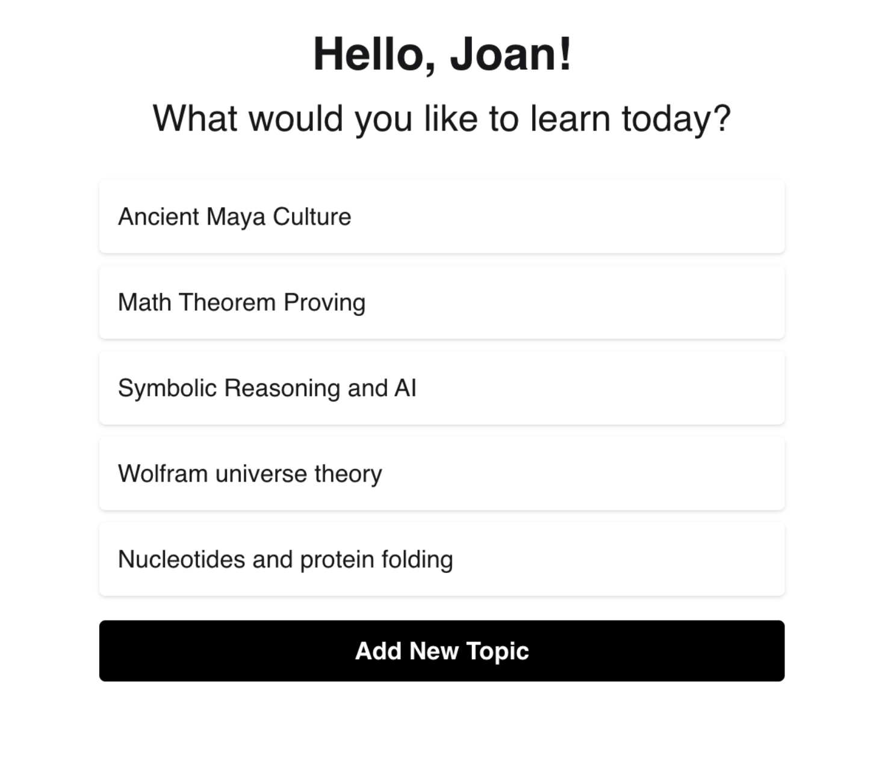
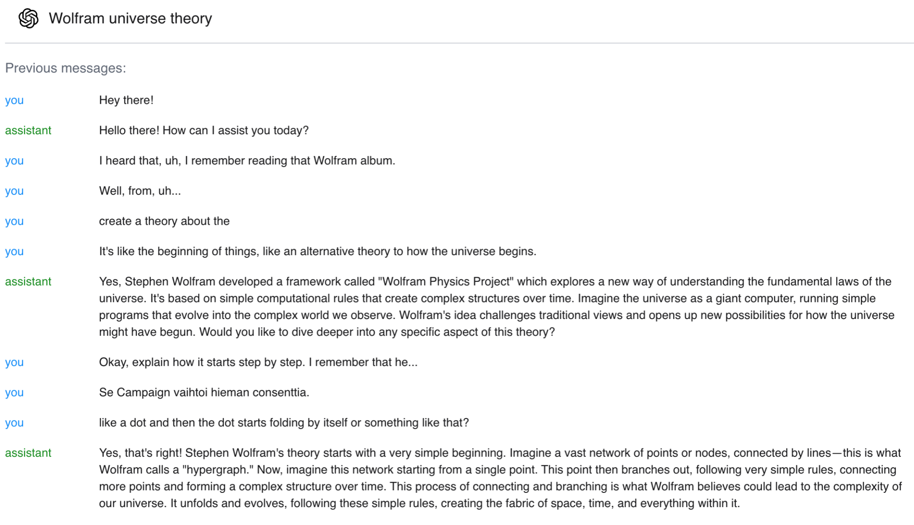
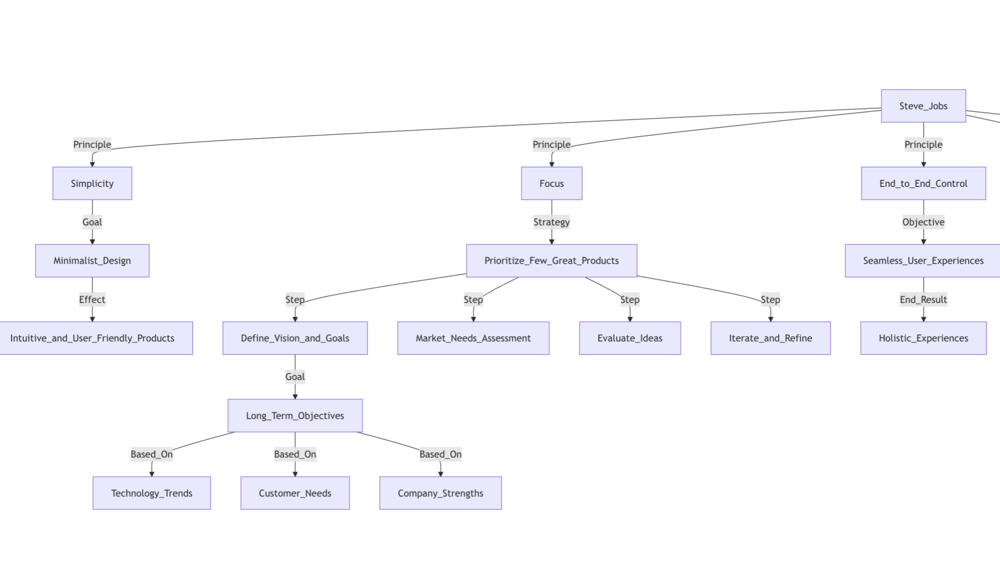

# Interactive Learning Console

This is a customized and improved version of the openai [realtime dashboard](https://github.com/openai/openai-realtime-console) for learning. 

### What's different?

- **Long sessions** are supported, on original dashboard, 15 mins is the max.
- **Conversation history** is maintained in the context of the whole conversation, thus every time you connect to a topic, the model has the context of the whole conversation.
- A right side panel generates a **mermaid graph** of the concepts learned.
- **Follow up questions** are generated to further the learning.
- **Tavily** is included as a tool call for web search, sometimes wanted to learn about latest research about a topic.

 
 

    

## Table of Contents
- [Interactive Learning Console](#interactive-learning-console)
    - [What's different?](#whats-different)
  - [Table of Contents](#table-of-contents)
  - [Getting Started](#getting-started)
    - [Usage](#usage)
    - [Buttons and Controls](#buttons-and-controls)
    - [Dependencies](#dependencies)

## Getting Started
`npm install`

### Usage
1. **Start a Session:** From the HomePage, create a new topic or continue from an existing one.
2. **Set-up api keys:** In the SettingsPage, set-up your OpenAI and Tavily api keys.
3. **Interact in Console:** In ConsolePage, view the conversation log, generate follow-up questions, and review the Mermaid.js graph summarizing concepts.
4. **Audio Visualization:** View audio waveforms for both user and assistant audio streams.
5. **Mermaid Graph Generation:** As you converse, a visual summary is generated automatically.

### Buttons and Controls
- **Connect/Disconnect:** Manages the real-time session state.
- **Options Menu:** Provides access to ChatGPT for review, graph regeneration, and transcript copy.
- **Follow-Up Questions:** Generated by AI to further conversation.

### Dependencies
- **React:** Main library for creating UI components.
- **Framer Motion:** For smooth animations.
- **Mermaid.js:** For graph generation.
- **OpenAI API:** Integrates real-time audio and text responses.
- **Tavily:** For external data search in conversations.